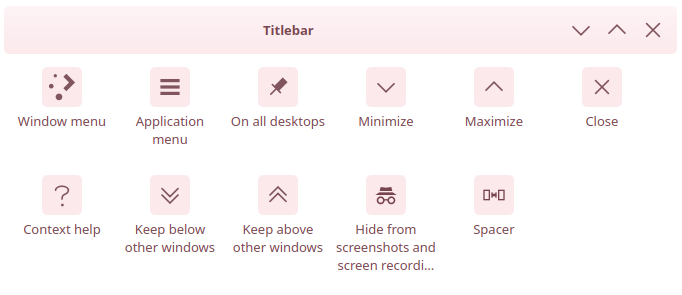
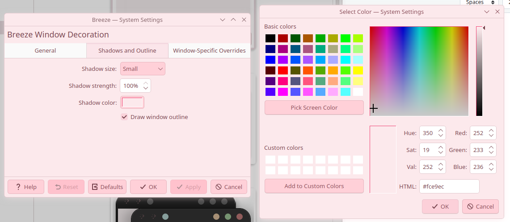

# KDE ricing

## My Setup
- **Color scheme** : Koga-Rosewood (accent color from wallpaper) (adapted for KDE 6, in this repo)
- **Applications style** : Breeze
- **Plasma style** : Breeze
- **Window decorations** : Breeze
- **Icons** : yet-another-monochrome-icon-set (in this repo)
- **Pointer**: shinonome ena (in this repo)
- **Widget**: Analog clock

Application menu icon (also you need to place "simple separator" between launcher and icon bar)

wallpaper in asset/wallpaper.jpg

andromeda launcher icon in asset/icon.png

## Window decoration configuration

>[!NOTE]
>Color scheme, icon set and pointer need to be installed via "install from file..." option in KDE apperance settings
